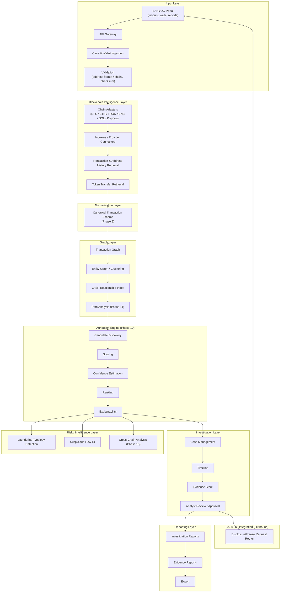

# SIH26182 — Automated Attribution of Unknown Cryptocurrency Wallets to Nearest VASPs
## Full Problem Research & Engineering Specification

**Prepared for:** Smart India Hackathon 2026, Problem Statement SIH26182
**Sponsoring Organization:** Ministry of Home Affairs (MHA), via Indian Cyber Crime Coordination Centre (I4C), CIS Division
**Document type:** Research-grounded, buildable engineering specification
**Prepared:** September 2026

### How to read this document

Every requirement below is tagged with a provenance category. This tagging is mandatory and preserved throughout — never assume something is an official SIH requirement just because it appears in an architecture diagram.

| Tag | Meaning |
|---|---|
| **[A]** | Explicit SIH requirement — traceable to the verified problem-statement text |
| **[A-opt]** | Explicitly stated by SIH as optional ("the system *may* additionally support...") |
| **[B]** | Reasonable engineering interpretation — needed to make an [A] requirement buildable, not stated verbatim by SIH |
| **[C]** | Proposed enhancement — our addition, not requested or implied by SIH |
| **[D]** | Optional/strategic feature — competition differentiator, safe to cut under time pressure |

---

## PHASE 0 — Source Verification

### 0.1 Authoritative source located

The official system of record is the SIH 2026 portal: **`https://sih.gov.in/sih2026PS`**. A direct fetch of this URL was attempted and blocked by the portal's bot-detection layer — this is a normal characteristic of the official SIH site, not a sign that the portal is unavailable. Every community mirror checked below links back to this same URL as its canonical source, and no mirror claims to be anything other than a secondary snapshot.

Because the primary source could not be fetched directly, this specification is built on **triangulated secondary sources**, per the source-priority order in the brief (community-maintained datasets are explicitly listed as acceptable secondary copies, not primary). The independent copies checked:

1. **`sih2026.vuce.in/ps/SIH26182`** — a structured, actively-maintained community archive (233 PS, CC-BY-4.0/MIT licensed, unofficial). This had the fullest capture: metadata, Background, Description, "system should," "system may," and Expected Solution sections.
2. **`github.com/NoBugNinja/Smart-India-Hackathon-SIH-2026-Problem-Statements`** — an independently authored, separately maintained tabular snapshot (title/org/theme only, no full description).
3. **`github.com/vedantchalke36/sih-2026-problem-statements`** and a Reskilll blog post — both surfaced the identical PS title and theme in independent search results.

### 0.2 Cross-check results

| Field | Source 1 (vuce.in) | Source 2 (NoBugNinja) | Agreement |
|---|---|---|---|
| PS ID | SIH26182 | SIH26182 | ✅ Match |
| Title | *Automated Attribution of Unknown Cryptocurrency Wallets to Nearest Virtual Asset Service Providers (VASPs) through Blockchain Intelligence APIs* | Identical | ✅ Match |
| Organization | Ministry of Home Affairs | Ministry of Home Affairs | ✅ Match |
| Theme | Blockchain & Cybersecurity | Blockchain & Cybersecurity | ✅ Match |
| Category | Software | Software (implied by theme table) | ✅ Match |
| Department | Indian Cyber Crime Coordination Centre (I4C), CIS Division | Not captured | — Source 1 only |

**Discrepancies found and how they were handled:**

- **Deadline inconsistency.** Source 1's own theme-listing page shows "30 September 2026" for SIH26182, while its PS detail page (the more specific, individually-rendered page) shows **"20 September 2026."** Both figures come from the *same* mirror, so this is not a cross-source conflict but an internal inconsistency in an actively-updated, unofficial archive (likely a stale cache on the listing view). **Resolution: do not treat either date as authoritative.** Teams should confirm the exact submission deadline on `sih.gov.in` directly before finalizing submission logistics — this specification does not depend on the exact date and is unaffected by the discrepancy.
- **No conflicting requirement text was found.** Every mirror that captured the full description text produced the same content; no source presented a materially different scope, feature list, or dataset claim for SIH26182 specifically.
- **No official dataset link was located.** No mirror surfaces a downloadable dataset, sandbox API, or sample wallet list specifically issued for SIH26182. This specification therefore treats **synthetic test data (Phase 22) as mandatory**, not optional, since no confirmed real dataset exists as of this research date.

### 0.3 Source fidelity note

The user-supplied brief that requested this document is a *task specification*, not a copy of the SIH problem statement — it does not itself assert PS content, so there is nothing in it to cross-check against. All Category **[A]** content in this document is instead sourced directly from the verified PS text captured in 0.1–0.2, reproduced below in paraphrased, requirement-decomposed form (Phase 1.3) rather than quoted at length.

---

## PHASE 1 — Full Problem Statement Extraction

### 1.1 Metadata

| Field | Value |
|---|---|
| PS ID | SIH26182 |
| Title | Automated Attribution of Unknown Cryptocurrency Wallets to Nearest Virtual Asset Service Providers (VASPs) through Blockchain Intelligence APIs |
| Organization | Ministry of Home Affairs |
| Department | Indian Cyber Crime Coordination Centre (I4C), CIS Division |
| Category | Software |
| Theme | Blockchain & Cybersecurity |
| Submission deadline | Unconfirmed — mirror shows conflicting 20/30 September 2026; verify on `sih.gov.in` |
| Source URLs | `sih.gov.in/sih2026PS` (official, bot-gated); `sih2026.vuce.in/ps/SIH26182` (community mirror, primary secondary source used here) |
| Source reliability | Official portal unreachable directly; secondary sources cross-verified against each other and internally consistent on all substantive content |
| Last verified | September 2026 (this research pass) |

### 1.2 Background — official framing, then plain-language technical translation

**As SIH frames it [A]:** Growing adoption of Virtual Digital Assets (VDAs) has made cybercrime investigation harder. LEAs regularly encounter wallet addresses tied to fraud, ransomware, investment scams, darknet activity, and laundering. Today, LEAs raise lawful disclosure requests through the **SAHYOG Portal** directly to known VASPs (exchanges, custodial wallet providers, trading platforms). The problem: the suspect wallet is frequently **unhosted** (self-custodial, no VASP attached), or the destination VASP is simply unknown, which stalls attribution, asset freezing, and beneficial-owner identification. Funds typically pass through several intermediary wallets before landing at a centralized exchange, and manually tracing that path to the "nearest direct-deposit-accepting exchange" requires blockchain-forensics expertise most investigators don't have and takes too long.

**Plain-language technical translation:**

- A **wallet** is a keypair/address controlling funds on a chain; it is not inherently tied to any identity.
- An **unhosted (self-custodial) wallet** has no KYC'd custodian — nobody to serve a legal request on. A **custodial wallet at a VASP** (exchange, broker, custodian) *does* have an identifiable legal entity behind it, subject to AML/KYC obligations.
- **VASP** (Virtual Asset Service Provider) is the FATF/PMLA term for any entity conducting exchange, transfer, safekeeping/administration, or issuance/sale services for virtual assets — in India, since the March 2023 PMLA notification, such entities are "reporting entities" required to register with FIU-IND and perform KYC/CDD.
- **Deposit addresses** are the addresses a VASP generates per-customer to receive incoming funds; **intermediary/hop wallets** are addresses used purely to relay funds (often to break simple tracing or consolidate/split amounts) before final deposit.
- **Wallet clustering** is the set of heuristics (common-input-ownership, change-address detection, behavioral fingerprinting) used to group addresses likely controlled by one actor.
- **Blockchain transaction tracing** is following the directed graph of transfers from a seed address outward (or, for the "nearest VASP" question, forward toward custodial deposit points).
- **Laundering flows** typically fan money out (peeling chains, layering across many hops/chains/mixers) specifically to defeat naive tracing — which is exactly why "nearest VASP" is a nontrivial graph problem, not a lookup.
- **Why manual attribution is slow:** an investigator must pull raw transaction data from block explorers or node RPCs one hop at a time, manually check each address against known-exchange address lists (often tribal knowledge or paid intelligence feeds), and manually judge which of several candidate paths is most likely genuine — for every case, across up to 6+ chains.
- **Why "nearest VASP" matters to LEAs specifically:** a lawful disclosure or freeze request can only be served on a real legal entity. The nearest VASP *is* the actionable target — it is the first point in the fund's path where India's PMLA/FIU-IND framework (or an equivalent foreign AML regime, for cross-border cases) actually gives LEAs a lever to pull.

### 1.3 Problem Description — decomposed into individually numbered requirements

Every bullet below is [A] unless marked otherwise, decomposed from the verified "The system should" / "The system may additionally support" text.

**Mandatory ("the system should") [A]:**

- **REQ-001** — System shall ingest suspect cryptocurrency wallet addresses reported during investigations via the SAHYOG platform.
- **REQ-002** — System shall automatically trace blockchain transaction paths outward from a suspect wallet.
- **REQ-003** — System shall identify the nearest centralized exchange reachable from the suspect wallet's transaction path.
- **REQ-004** — System shall identify the nearest custodial wallet service reachable from the suspect wallet's transaction path.
- **REQ-005** — System shall identify the nearest VASP receiving a direct deposit from (a descendant of) the suspect wallet.
- **REQ-006** — System shall map deposit addresses and transaction flows across multiple blockchain networks, at minimum: Bitcoin, Ethereum, Tron, BNB Chain, Solana, Polygon.
- **REQ-007** — System shall extend chain coverage to "other major chains" beyond the six named — coverage is explicitly open-ended, not capped at six.
- **REQ-008** — System shall support identification of exchange clusters (groups of addresses controlled by one exchange).
- **REQ-009** — System shall support identification of hot wallets.
- **REQ-010** — System shall support identification of deposit wallets.
- **REQ-011** — System shall support identification of mixers/tumblers.
- **REQ-012** — System shall support identification of DeFi bridges.
- **REQ-013** — System shall support identification of cross-chain swap services.
- **REQ-014** — System shall integrate the SAHYOG platform with blockchain intelligence APIs and graph analytics engines.
- **REQ-015** — System shall provide automated tagging of suspected VASPs.
- **REQ-016** — System shall provide a confidence score for each suspected-VASP tag.
- **REQ-017** — System shall generate investigation-ready reports for LEAs.
- **REQ-018** — System shall assist investigators in routing lawful disclosure or freezing requests to the correct VASP through the SAHYOG portal.

**Explicitly optional ("the system may additionally support") [A-opt]:**

- **REQ-019 [A-opt]** — Visualization of fund movement.
- **REQ-020 [A-opt]** — Cross-chain transaction mapping (deeper linkage analysis beyond basic multi-chain coverage in REQ-006/007).
- **REQ-021 [A-opt]** — Risk scoring of wallets/flows.
- **REQ-022 [A-opt]** — Identification of laundering typologies.
- **REQ-023 [A-opt]** — Alerting for high-risk wallets linked to ransomware, darknet activity, terrorism financing, or fraud ecosystems.

**From the "Expected Solution" section [A]:**

- **REQ-024** — Automated identification of the nearest VASP/exchange linked to an unknown wallet (restates REQ-003–005 as the overall system outcome).
- **REQ-025** — API-driven blockchain tracing and attribution (confirms an API-integration architecture, not a manual-analyst tool).
- **REQ-026** — Multi-chain transaction analysis *and visualization* (visualization is elevated from "may" to part of the expected solution — treat as [A], not [A-opt]).
- **REQ-027** — Real-time generation of investigative intelligence (a latency/performance requirement, not just a functional one).
- **REQ-028** — Risk classification of wallets and transaction flows (again elevates REQ-021 toward expected, not merely optional).
- **REQ-029** — A dashboard for LEAs with case-based analytics and reporting.
- **REQ-030** — A scalable architecture capable of handling large-volume blockchain transaction analysis.

**Outcome goals (not individually testable requirements, but the definition of success) [A]:**

- **GOAL-001** — Reduce investigation time.
- **GOAL-002** — Improve asset-freezing efficiency.
- **GOAL-003** — Enhance attribution capabilities.
- **GOAL-004** — Strengthen cross-border cybercrime investigations involving VDAs.

*Engineering note [B]:* REQ-019–023 are formally "may," but REQ-026 and REQ-028 pull visualization and risk-scoring back into the Expected Solution section as though mandatory. **Recommendation:** build visualization and basic risk scoring as core (matching REQ-026/028), and treat laundering-typology classification, cross-chain deep-linkage, and high-risk alerting (REQ-020, 022, 023) as true stretch goals for a hackathon timeline. This is a judgment call, not a restatement of SIH text — flagged as [B].

### 1.4 Expected Solution — capability breakdown

| Capability class | Items |
|---|---|
| **Mandatory** | Wallet ingestion (REQ-001); multi-chain transaction tracing (REQ-002, 006, 007); nearest-VASP identification (REQ-003–005, 024); confidence-scored VASP tagging (REQ-015–016); investigation report generation (REQ-017); SAHYOG-routed disclosure/freeze assistance (REQ-018) |
| **Implied** (needed to satisfy the above, not separately stated) [B] | Address/entity clustering engine; canonical multi-chain data model; evidence storage with provenance; case management; RBAC, since this touches active LEA investigations |
| **Optional (explicit)** | REQ-019–023 |
| **Integration requirements** | SAHYOG API integration (bidirectional — see Phase 7); blockchain intelligence API layer (REQ-014, 025) |
| **Analytics requirements** | Graph analytics engine (REQ-014); risk classification (REQ-028) |
| **Visualization requirements** | Fund-flow visualization (REQ-026); dashboard (REQ-029) |
| **Reporting requirements** | Investigation-ready, LEA-consumable reports (REQ-017) |
| **Scalability requirements** | Large-volume, real-time analysis (REQ-027, 030) |


---

## PHASE 2 — Operational Problem Analysis

### 2.1 Current investigator workflow (as it plausibly runs today)

1. **Complaint intake.** A cybercrime/financial-fraud complaint arrives — via the National Cybercrime Reporting Portal (cybercrime.gov.in), the 1930 helpline, or a police FIR — and is assigned to an investigating officer.
2. **Suspect wallet identified.** The wallet surfaces from a victim's transaction receipt, a bank/UPI trail leading to an on-ramp, a ransom note, or intelligence from another agency.
3. **Wallet entered into an investigative system.** Today this is largely manual: the officer records the address in a case file or, at best, a spreadsheet.
4. **Blockchain activity collected.** The officer (or a forensics unit) manually queries a public block explorer per chain — Etherscan-family explorers, Blockchair, TronScan, Solscan, etc. — one address at a time.
5. **Transactions traversed.** Each outgoing transaction is opened manually to see where funds went next; this is repeated hop by hop.
6. **Intermediary wallets identified.** No systematic clustering — the officer eyeballs which addresses look like "pass-through" wallets based on transaction count/timing.
7. **Exchange/VASP-related addresses detected.** Recognition depends on the officer's personal knowledge of known exchange hot-wallet addresses, or ad hoc web searches — there is no unified, queryable label database available to most investigators.
8. **Candidate VASPs ranked.** Informal, judgment-based; no scoring methodology.
9. **Evidence supporting attribution collected.** Screenshots of explorer pages, manually assembled — no cryptographic or systematic provenance chain.
10. **Investigator reviews attribution.** Often the investigator *is* the analyst — no independent verification step.
11. **Lawful disclosure/freezing process initiated.** A request is drafted and routed to the identified VASP, today via the SAHYOG portal (per the PS background) once Phase-2 lawful-data-request functionality is live, or via direct correspondence/legal process otherwise.
12. **Investigation report generated.** Manually compiled, typically as a Word document, combining screenshots, notes, and conclusions.

### 2.2 Where the process breaks down

| Step | Bottleneck | Consequence |
|---|---|---|
| 4–6 | Manual, one-hop-at-a-time explorer queries across up to 6+ chains, each with a different UI/data model | Hours-to-days per case just for data collection |
| 7 | No systematic, queryable VASP/exchange address-label database at the investigator's fingertips | Attribution depends on individual officer's tribal knowledge; misses are common |
| 8 | No formal scoring or ranking methodology | Inconsistent conclusions across officers/cases; not defensible under scrutiny |
| 9–10 | No structured evidence chain, no independent scoring to sanity-check the human conclusion | Weak evidentiary basis; vulnerable to challenge |
| 11 | Time lost between "we think we know the VASP" and "the lawful request reaches the right legal entity" | Funds move/are withdrawn before a freeze request lands — the core problem this PS exists to solve |
| 12 | Manual report assembly | Further delay, inconsistent report quality across officers |

### 2.3 What SIH26182 is actually asking to be automated [B]

Reading REQ-001 through REQ-030 against this workflow, the system is not being asked to replace investigator judgment (Phase 10 stays human) or to prove beneficial ownership (that remains a legal/investigative conclusion, not a system output — see Phase 19). It is being asked to compress **steps 4 through 9** — the purely mechanical, multi-chain, multi-hop data-collection-and-candidate-generation work — from a manual, hours-to-days process into an automated, minutes-scale pipeline that hands the investigator a ranked, evidence-backed, explainable shortlist of candidate VASPs instead of a blank block explorer. Step 11 is also explicitly in scope (REQ-018): the system should shorten the gap between "candidate identified" and "lawful request routed" by integrating directly with SAHYOG's request-routing mechanism, rather than requiring a human to re-key the finding into a separate disclosure request.

---

## PHASE 3 — Defining "Nearest VASP" Precisely

### 3.1 What the source text actually says

This is worth being precise about, because the PS text is *not* vague on this point the way a generic hackathon brief might be. Two phrases anchor it:

- Background: manually identifying **"the nearest direct deposit accepting exchange"** is the bottleneck.
- Requirements: identify the VASP **"receiving direct deposits from the suspect wallet"** (REQ-005), i.e., the nearest **centralized exchange** or **custodial wallet service** (REQ-003–004).

So SIH has already substantially defined "nearest": it means the **first VASP-controlled address that receives a deposit** somewhere along the transaction path forward from the suspect wallet — not the geographically nearest exchange, not the highest-volume exchange, and not necessarily the fewest-hops candidate if that candidate isn't actually a direct-deposit destination.

### 3.2 Candidate interpretations evaluated

| Interpretation | Fit to SIH text | Verdict |
|---|---|---|
| Fewest transaction hops, full stop | Partial — ignores that some short paths dead-end at non-VASP addresses (another self-custodial wallet, a discarded intermediary) | Necessary signal, not sufficient alone |
| Shortest temporal path (fastest-observed route) | Not supported by text | Reject as primary definition; useful as a secondary/tie-break signal |
| First direct-deposit destination | **Directly supported by text** ("direct deposit accepting exchange") | **Primary definition** |
| Highest-confidence exchange-controlled destination | Partially supported — REQ-016 requires a confidence score alongside the tag, implying "nearest" and "confidence" are two separate axes, not one blended score | Confidence is a *qualifier* on the nearest candidate, not a replacement for "nearest" |
| Highest-value flow destination | Not supported — the text never mentions amount as a proximity criterion | Reject as primary definition; useful as supporting evidence |
| Combination of topology + timing + value + confidence | This is what REQ-016 (confidence scoring) implicitly demands once real-world paths are ambiguous (multiple candidate VASPs, mixers, splits) | **Adopted, layered on top of the primary definition** |

**Conclusion [B]:** "Nearest VASP" = *the VASP-attributed address closest, by directed transaction-graph distance, to the suspect wallet, among addresses that plausibly represent an actual custodial deposit (not a pass-through) — with confidence scored and reported separately, exactly as REQ-016 requires, rather than folded into the ranking itself.* This is a direct engineering reading of explicit text, not an invented interpretation.

### 3.3 VASP Attribution Score — formal design

Two independent numbers are produced per candidate, matching the REQ-005/REQ-016 split above:

**1. Proximity Rank** — primary key, lower is better:

```
proximity_rank(candidate) = weighted_graph_distance(suspect_wallet → candidate.deposit_address)
```

`weighted_graph_distance` is not a raw hop count. Each edge (hop) in the path carries a traversal cost:

```
edge_cost = base_hop_cost
          + mixing_penalty         (if the edge passes through a flagged mixer/tumbler node)
          + time_decay_penalty     (large time gaps between hops reduce path confidence)
          + fan_out_penalty        (edges from high-out-degree "peeling chain" addresses)
```

This keeps "nearest" grounded in graph topology (matching the text) while not naively rewarding a 2-hop path through a known mixer over a 4-hop path with no mixing — a 2-hop mixer path is *closer* but *less credible* as the genuine deposit route, and credibility is what REQ-016 asks the system to separately report, never silently substitute for distance.

**2. Confidence Score** — reported alongside, 0–100, independent of rank:

```
confidence = w1·evidence_tier_score        (Phase 5 evidence tiers, Tier 1=100 ... Tier 4=25)
           + w2·label_source_agreement     (how many independent intelligence sources agree)
           + w3·address_reuse_signal       (deposit address pattern consistency with known VASP behavior)
           + w4·cluster_consistency        (candidate sits inside a stable, previously-observed cluster)
           + w5·path_integrity             (no ambiguous forks / no un-modelled cross-chain jump on the winning path)
           + w6·evidence_freshness         (label/observation recency)
```

**On weight calibration [B]:** Per the brief's instruction not to invent arbitrary weights, no fixed numeric weights are proposed here. Instead: (a) start with **equal weighting** (`w1..w6 = 1/6`) as an unbiased MVP baseline; (b) log every case's system-suggested ranking alongside the investigator's final human-confirmed VASP once disclosure responses come back; (c) once ~50–100 confirmed cases exist, fit weights via **logistic regression** against that ground truth (confirmed-correct = 1, confirmed-wrong = 0) — this is the smallest defensible calibration method, and it produces weights that are traceable to real outcomes rather than guessed. Until that data exists, the system must display confidence as **banded** (High/Medium/Low, from Phase 5's evidence tiers) rather than a false-precision numeric score — this is discussed further in Phase 5.

**Non-negotiable rule [A, restated from the PS's own caution against overclaiming, formalized in Phase 5/19]:** proximity_rank and confidence are always shown together. A short, high-confidence path outranks a short, low-confidence one; the system never presents "nearest" and "correct" as the same claim.

---

## PHASE 4 — Blockchain Coverage

REQ-006/007 name six chains explicitly and require "other major chains" support to be architecturally open-ended. Presented as a comparison table for scannability — an engineer building chain adapters needs to compare these side-by-side, not read six separate essays saying the same fifteen things in different words.

| Attribute | Bitcoin | Ethereum | Tron | BNB Chain | Solana | Polygon |
|---|---|---|---|---|---|---|
| **Account model** | UTXO (unspent transaction outputs) | Account-based | Account-based | Account-based (EVM) | Account-based | Account-based (EVM) |
| **Address format** | Base58Check / Bech32 (P2PKH, P2SH, bech32 SegWit) | Hex, 20-byte, EIP-55 checksum | Base58Check, `T`-prefixed | Hex (EVM-identical to Ethereum) | Base58, 32-byte ed25519 pubkey | Hex (EVM-identical to Ethereum) |
| **Native asset** | BTC | ETH | TRX | BNB | SOL | POL (MATIC legacy) |
| **Tx identifier** | txid (double-SHA256) | tx hash (Keccak256) | tx hash | tx hash | tx signature (base58) | tx hash |
| **Token model** | None natively (Runes/Ordinals exist but are not the PS's concern) | ERC-20 (fungible), ERC-721/1155 (NFT, out of scope) | TRC-20 | BEP-20 | SPL tokens | ERC-20-compatible |
| **Smart contracts / internal txs** | Not applicable (scripts, not general contracts) | Yes — internal (message) calls invisible on plain tx list, must be pulled via trace/debug APIs or an indexer | Yes — TVM, similar internal-call visibility gap | Yes — EVM-identical | Yes — programs; different execution/log model than EVM traces | Yes — EVM-identical |
| **"Direct deposit" pattern typical of VASPs** | Fresh P2SH/Bech32 deposit address per customer, consolidated periodically to a hot wallet | Same EOA reused as deposit address is common; some exchanges use per-customer contract wallets | Per-customer deposit address, frequent sweep to a small set of hot wallets (very common laundering off-ramp given low fees) | Deposit-address pattern mirrors Ethereum | Associated Token Accounts (ATAs) per customer per token | Mirrors Ethereum |
| **Required indexing strategy** | Full-node or third-party indexer with UTXO-set tracking; clustering needs multi-input heuristic | Full-node/archive + internal-tx tracing (Erigon/Geth + trace API, or an indexer) | Full/solidity node or third-party indexer (native trace support weaker than EVM tooling) | Standard EVM indexer (Geth-compatible) | Solana RPC + getSignaturesForAddress pagination; higher tx volume means indexing cost is non-trivial | Standard EVM indexer |
| **Representative API/provider options** | Blockchair, Blockstream Esplora, Mempool.space, Etherscan's multichain explorer (adds BTC), node-hosted (Bitcoin Core) | Etherscan family, Alchemy, Infura, Covalent/GoldRush, Moralis, Bitquery | TronGrid, TronScan API, Bitquery | BscScan (Etherscan-family multichain), Bitquery | Solscan, Helius, QuickNode, Bitquery | PolygonScan (Etherscan-family), Alchemy, Bitquery |
| **Key attribution challenge** | UTXO clustering heuristics can misfire on CoinJoin/collaborative txs (privacy-preserving pools) | Internal-tx tracing needed to catch contract-mediated transfers, or deposits routed through a smart-contract wallet | High mixer/instant-swap usage in fraud flows because of low fees and fast finality | Fork of Ethereum's problem set; also a common bridge target | Program-based DeFi flows (swaps via AMM programs) don't look like simple transfers | Frequently used as a cheap bridging hop, complicating cross-chain path reconstruction |
| **Cross-chain relevance** | Wrapped BTC (WBTC) bridges into EVM chains — a common laundering hop out of BTC | Native bridging hub — many bridge contracts originate/terminate here | Bridges to Ethereum/BSC exist but are less standardized | Frequent bridge target given low fees | Wormhole and similar bridges connect to Solana | Purpose-built as an Ethereum scaling/bridge chain — expect high bridge traffic |

### 4.1 MVP vs. production-scale coverage [B]

| | MVP (hackathon demo) | Production scale |
|---|---|---|
| Chains | Bitcoin + Ethereum + Tron (covers the three chains dominant in Indian cyber-fraud/pig-butchering casework, per typical LEA case patterns) | All six named chains + open adapter framework for "other major chains" (REQ-007) |
| Token support | Native asset only, plus the single dominant stablecoin per chain (USDT on Tron/Ethereum) | Full ERC-20/TRC-20/SPL/BEP-20 token universe with dynamic token-metadata resolution |
| Internal-tx / contract tracing | Basic (best-effort via a hosted API's trace endpoint) | Full archive-node-grade tracing with contract-call decoding |
| Indexing | Third-party API/indexer only (Phase 20) | Hybrid: own indexer for the highest-volume chains, third-party API as a fallback/cross-check |

---

## PHASE 5 — VASP Intelligence & Evidence Hierarchy

### 5.1 Legitimate sources for "this address belongs to a VASP" [B, grounded in Phase 20 research]

- **Exchange-published addresses** — some VASPs publish proof-of-reserves wallet lists (a growing but inconsistent practice).
- **FIU-IND registered-entity list** — India's PMLA framework (March 2023 notification) requires VDA service providers to register as "reporting entities" with FIU-IND; the registered-entity list (28+ entities as of the most recent public figures, with ongoing enforcement action against unregistered offshore VASPs) is a starting point for *which legal entities exist*, even though FIU-IND's public list does not itself publish wallet addresses — it establishes the legal-entity side of the attribution the system ultimately needs to route a request to.
- **Commercial blockchain-intelligence label sets** — Chainalysis, Elliptic, TRM Labs, Merkle Science, Crystal Intelligence and similar vendors maintain proprietary address-attribution databases built from KYC'd exchange withdrawals, honeypot deposits, and OSINT; see Phase 20 for provider comparison.
- **Regulatory/sanctions data** — OFAC SDN-listed addresses, INTERPOL/FATF advisories on non-compliant VASPs.
- **Open-source intelligence (OSINT)** — public statements, breach data, blockchain explorers' community-tagged labels (e.g., Etherscan's public name tags), forum/social-media leaks.
- **Behavioral/graph-derived labels** — addresses inferred to be exchange-controlled purely from transaction behavior (very high in-degree, structured sweep patterns to a small hot-wallet set, consistent time-of-day activity) even with no external label — genuinely useful, but categorically weaker evidence, hence its own tier below.

### 5.2 Evidence hierarchy

| Tier | Name | What qualifies | Example |
|---|---|---|---|
| **Tier 1** | Verified attribution | Direct authoritative confirmation: the VASP's own published wallet list, a confirmed FIU-IND/regulatory disclosure, or a prior confirmed lawful-disclosure response for this exact address | Exchange's own proof-of-reserves address list |
| **Tier 2** | High-confidence attribution | Multiple independent commercial/OSINT sources agree, no contradicting signal | Chainalysis + Elliptic + community explorer tag all agree on the same label |
| **Tier 3** | Probable attribution | Strong behavioral/graph evidence (consolidation pattern, deposit-address structure matching known VASP behavior) but no direct external confirmation | Address clusters tightly with a known Tier-1 hot wallet via consolidation edges, but has no label of its own |
| **Tier 4** | Candidate | Weak/incomplete evidence — a single low-confidence source, or purely topological proximity with no supporting behavioral signal | Address is 2 hops from the suspect wallet and nothing else is known about it |

**Hard rule [A, elevated from the brief's explicit instruction]:** the system must never render a Tier 3 or Tier 4 attribution using language that implies certainty ("this wallet belongs to Exchange X"). UI copy, report copy, and API responses must carry the tier and its plain-language meaning ("probable," "candidate — insufficient evidence to confirm") every time an attribution is surfaced — this is enforced at the presentation layer, not left to the reader to infer from a number.

---

## PHASE 6 — Graph Model

### 6.1 Node types

| Node type | Key properties | Purpose |
|---|---|---|
| `Wallet` / `Address` | `address`, `chain`, `address_type`, `first_seen`, `last_seen`, `balance_snapshot` | Atomic on-chain identity unit |
| `Transaction` | `tx_hash`, `chain`, `block_height`, `timestamp`, `fee`, `status` | Edge-bearing event connecting addresses |
| `Block` | `chain`, `height`, `hash`, `timestamp` | Anchors transactions to chain time/order |
| `VASP` | `vasp_id`, `legal_name`, `fiu_ind_reg_status`, `jurisdiction`, `contact_channel` | Legal entity — the eventual disclosure-request target |
| `Exchange` (subtype of VASP) | `exchange_id`, `known_hot_wallets[]` | Specialization for centralized exchanges specifically |
| `DepositAddress` | `address`, `owning_vasp_id`, `customer_ref (opaque)` | Per-customer address a VASP controls |
| `HotWallet` / `ColdWallet` | `address`, `owning_vasp_id`, `wallet_role` | VASP-operated consolidation/custody addresses |
| `Mixer` / `Tumbler` | `service_name (if known)`, `chain`, `confidence` | Privacy-preserving service — evidence dead-end, flagged not deanonymized |
| `Bridge` | `bridge_name`, `source_chain`, `dest_chain`, `contract_address` | Cross-chain value-transfer point |
| `DeFiProtocol` | `protocol_name`, `chain`, `contract_address`, `protocol_type` | Swap/liquidity/lending contract encountered on a path |
| `Token` | `symbol`, `contract_address`, `chain`, `decimals` | Non-native asset moved in a transaction |
| `Chain` | `chain_id`, `name`, `account_model` | Reference node for chain-level metadata |
| `Case` | `case_id`, `investigator_id`, `status`, `opened_at` | Investigation container — everything ties back to a case |
| `EntityCluster` | `cluster_id`, `method`, `confidence` | Output of clustering heuristics — a set of addresses believed co-controlled |

### 6.2 Edge types

| Edge | From → To | Key properties | Meaning |
|---|---|---|---|
| `SENDS` / `RECEIVES` | Address → Transaction → Address | `amount`, `asset`, `timestamp` | Directional value transfer |
| `INPUT_OF` / `OUTPUT_OF` | Address → Transaction | `amount` | UTXO-model specific (Bitcoin) |
| `CONTROLLED_BY` | Address → EntityCluster or VASP | `confidence`, `evidence_tier` | Attribution edge — the core output of the engine |
| `BELONGS_TO_CLUSTER` | Address → EntityCluster | `method`, `confidence` | Clustering-heuristic output |
| `DEPOSIT_TO` | Address → DepositAddress | `amount`, `timestamp` | The specific edge type "nearest VASP" search terminates on |
| `CONSOLIDATES_TO` | DepositAddress → HotWallet | `amount`, `timestamp` | VASP-internal sweep pattern — strengthens VASP-ownership evidence |
| `SPLITS_TO` | Address → Address\[\] | `fan_out_count` | Peeling-chain / structuring pattern |
| `BRIDGES_TO` | Address (chain A) → Address (chain B) | `bridge_id`, `time_delta`, `confidence` | Cross-chain correlation edge — confidence degrades with time gap (Phase 13) |
| `SWAPS_TO` | Token → Token (via DeFiProtocol) | `protocol_id`, `rate`, `timestamp` | On-chain asset conversion |
| `ASSOCIATED_WITH` | Address → Case | `role` (suspect/intermediary/candidate-VASP) | Ties graph entities into an investigation |
| `OBSERVED_IN_CASE` | Transaction → Case | `added_by`, `added_at` | Evidence-inclusion audit point |

### 6.3 Storage engine choice for this schema

See Phase 26 for full comparison; in short, this schema is a natural fit for a **labeled property graph** (Neo4j/Memgraph) because both node and edge properties (confidence, evidence_tier, amount, timestamp) are first-class and queried constantly — a relational-only implementation would require constant multi-way joins to reconstruct what the graph model gives natively (see Phase 8 for the relational side of this, used for case/audit/report data rather than the transaction graph itself).

---

## PHASE 7 — End-to-End System Architecture



### 7.1 Layer responsibilities

- **Input layer.** Receives wallet/case reports from SAHYOG (REQ-001), validates chain/address format before any expensive downstream work runs, and creates the `Case` node.
- **Blockchain intelligence layer.** One adapter per chain (Phase 4/20), each normalizing that chain's RPC/API quirks behind a common `BlockchainProvider` interface (Phase 20.3) so the attribution engine never touches chain-specific code.
- **Normalization layer.** Converts every chain's output into the canonical schema (Phase 9) — this is the seam that makes REQ-007 ("other major chains") an adapter-addition problem, not a rewrite.
- **Graph layer.** Builds and maintains the transaction graph and entity/cluster graph; this is where REQ-002/REQ-006 tracing actually happens.
- **Attribution engine.** Implements Phase 10's eight stages; produces the ranked, evidence-backed, explainable candidate list REQ-015/016 require.
- **Risk/intelligence layer.** Optional-tier (REQ-020–023) analytics layered on top of the same graph — deliberately built as a consumer of the graph layer, not entangled with the attribution engine's core path, so it can be cut under time pressure without breaking the mandatory path.
- **Investigation layer.** Case state, timeline, and the mandatory **human review/approval step** — the system never auto-submits an attribution as final; REQ-018's "assist... routing" stops short of "auto-execute" (see Phase 19).
- **Reporting layer.** REQ-017's investigation-ready report generation (Phase 16).
- **SAHYOG integration layer.** Bidirectional: **inbound**, wallet/case reports arrive from SAHYOG (REQ-001); **outbound**, a reviewed, analyst-approved disclosure/freeze request is routed back through SAHYOG to the target VASP (REQ-018). *Engineering note [B]:* SAHYOG's publicly documented capability to date is content-takedown routing under IT Act §79(3)(b), launched October 2024; a "Phase 2" extension to lawful data requests was announced as planned but its API contract is not publicly published. **This specification therefore treats the exact SAHYOG API surface as an unknown to be obtained from I4C directly**, and isolates all SAHYOG-facing code behind a single adapter interface (`SahyogGateway`) so the rest of the system is unaffected once the real contract is available — do not hard-code assumptions about SAHYOG's request/response schema elsewhere in the codebase.

---

## PHASE 8 — Relational Data Model

Presented as SQL DDL rather than a seven-column prose table per entity — this is more compact, and directly buildable (a migration can be generated from this almost verbatim), which the brief asks for explicitly. Type/nullable/PK/FK/index/uniqueness are all native to the syntax; `--` comments carry each field's purpose. This covers the case-management, audit, and attribution-result side of the system; the transaction graph itself lives in the graph store (Phase 6), referenced here only by ID.

```sql
-- ===================== IDENTITY & CASE MANAGEMENT =====================

CREATE TABLE investigators (
    investigator_id     UUID PRIMARY KEY DEFAULT gen_random_uuid(),
    badge_id            VARCHAR(64) NOT NULL UNIQUE,         -- links to LEA personnel record, never displayed publicly
    display_name        VARCHAR(128) NOT NULL,
    department          VARCHAR(128) NOT NULL,                -- e.g. "I4C", "State Cyber Cell"
    role                VARCHAR(32)  NOT NULL,                 -- 'investigator' | 'reviewer' | 'admin'  (Phase 18 RBAC)
    is_active           BOOLEAN NOT NULL DEFAULT TRUE,
    created_at          TIMESTAMPTZ NOT NULL DEFAULT now()
);

CREATE TABLE cases (
    case_id             UUID PRIMARY KEY DEFAULT gen_random_uuid(),
    sahyog_case_ref      VARCHAR(128) UNIQUE,                  -- external SAHYOG case identifier, nullable until linked
    title               VARCHAR(256) NOT NULL,
    status              VARCHAR(32)  NOT NULL DEFAULT 'open',  -- open | under_review | disclosure_requested | closed
    priority            VARCHAR(16)  NOT NULL DEFAULT 'medium',
    lead_investigator_id UUID NOT NULL REFERENCES investigators(investigator_id),
    opened_at           TIMESTAMPTZ NOT NULL DEFAULT now(),
    closed_at           TIMESTAMPTZ
);
CREATE INDEX idx_cases_status ON cases(status);
CREATE INDEX idx_cases_lead ON cases(lead_investigator_id);

-- ===================== CHAIN-AGNOSTIC BLOCKCHAIN REFERENCE DATA =====================

CREATE TABLE chains (
    chain_id            SMALLINT PRIMARY KEY,                  -- small enum-like table: 1=BTC,2=ETH,3=TRX,4=BNB,5=SOL,6=MATIC...
    chain_code          VARCHAR(16) NOT NULL UNIQUE,            -- 'BTC','ETH','TRON','BNB','SOL','POLYGON'
    account_model       VARCHAR(16) NOT NULL,                   -- 'utxo' | 'account'
    native_asset_symbol VARCHAR(16) NOT NULL
);

CREATE TABLE wallet_addresses (
    address_pk          UUID PRIMARY KEY DEFAULT gen_random_uuid(),
    chain_id            SMALLINT NOT NULL REFERENCES chains(chain_id),
    address             VARCHAR(128) NOT NULL,                  -- raw chain-native address string
    address_type        VARCHAR(32),                            -- 'eoa' | 'contract' | 'p2sh' | 'bech32' | ...
    first_seen_at       TIMESTAMPTZ,
    last_seen_at        TIMESTAMPTZ,
    UNIQUE (chain_id, address)                                   -- an address string is only unique within its chain
);
CREATE INDEX idx_wallet_addr_lookup ON wallet_addresses(chain_id, address);

CREATE TABLE tokens (
    token_id            UUID PRIMARY KEY DEFAULT gen_random_uuid(),
    chain_id            SMALLINT NOT NULL REFERENCES chains(chain_id),
    contract_address    VARCHAR(128),                           -- NULL for native asset
    symbol              VARCHAR(32) NOT NULL,
    decimals            SMALLINT NOT NULL DEFAULT 18,
    UNIQUE (chain_id, contract_address)
);

CREATE TABLE blocks (
    block_pk             UUID PRIMARY KEY DEFAULT gen_random_uuid(),
    chain_id             SMALLINT NOT NULL REFERENCES chains(chain_id),
    height                BIGINT NOT NULL,
    block_hash            VARCHAR(128) NOT NULL,
    block_timestamp        TIMESTAMPTZ NOT NULL,
    UNIQUE (chain_id, height)
);

CREATE TABLE transactions (
    tx_pk                UUID PRIMARY KEY DEFAULT gen_random_uuid(),
    chain_id              SMALLINT NOT NULL REFERENCES chains(chain_id),
    tx_hash                VARCHAR(128) NOT NULL,
    block_pk               UUID REFERENCES blocks(block_pk),     -- nullable: mempool/unconfirmed
    from_address_pk        UUID REFERENCES wallet_addresses(address_pk),  -- nullable for UTXO multi-input txs; see graph store for full input/output set
    to_address_pk           UUID REFERENCES wallet_addresses(address_pk),
    token_id                UUID REFERENCES tokens(token_id),     -- NULL = native asset transfer
    amount                  NUMERIC(38,18) NOT NULL,
    fee                     NUMERIC(38,18),
    tx_status                VARCHAR(16) NOT NULL DEFAULT 'confirmed',  -- confirmed | pending | reorg_dropped
    tx_type                  VARCHAR(32),                          -- transfer | contract_call | swap | bridge | internal
    source_provider           VARCHAR(64) NOT NULL,                 -- which API/provider this record came from (Phase 17 provenance)
    ingested_at                TIMESTAMPTZ NOT NULL DEFAULT now(),
    UNIQUE (chain_id, tx_hash, from_address_pk, to_address_pk, amount)  -- de-duplication guard, see Phase 24
);
CREATE INDEX idx_tx_from ON transactions(from_address_pk);
CREATE INDEX idx_tx_to ON transactions(to_address_pk);
CREATE INDEX idx_tx_hash ON transactions(chain_id, tx_hash);

-- ===================== VASP INTELLIGENCE =====================

CREATE TABLE vasps (
    vasp_id               UUID PRIMARY KEY DEFAULT gen_random_uuid(),
    legal_name             VARCHAR(256) NOT NULL,
    fiu_ind_registered      BOOLEAN NOT NULL DEFAULT FALSE,       -- per PMLA reporting-entity status, Phase 19
    jurisdiction             VARCHAR(64),
    contact_channel_ref      VARCHAR(256),                        -- SAHYOG-side reference to route disclosure requests
    is_active                 BOOLEAN NOT NULL DEFAULT TRUE
);

CREATE TABLE vasp_addresses (
    vasp_address_id         UUID PRIMARY KEY DEFAULT gen_random_uuid(),
    vasp_id                   UUID NOT NULL REFERENCES vasps(vasp_id),
    address_pk                 UUID NOT NULL REFERENCES wallet_addresses(address_pk),
    address_role                VARCHAR(32) NOT NULL,               -- 'deposit' | 'hot_wallet' | 'cold_wallet'
    evidence_tier                SMALLINT NOT NULL,                  -- 1-4, Phase 5
    label_source                  VARCHAR(64) NOT NULL,               -- 'vasp_disclosure' | 'fiu_ind' | 'commercial_intel' | 'osint' | 'behavioral'
    confirmed_at                   TIMESTAMPTZ,
    UNIQUE (address_pk, vasp_id, address_role)
);
CREATE INDEX idx_vasp_addr_lookup ON vasp_addresses(address_pk);

CREATE TABLE clusters (
    cluster_id                UUID PRIMARY KEY DEFAULT gen_random_uuid(),
    method                      VARCHAR(64) NOT NULL,               -- 'common_input_ownership' | 'behavioral' | 'consolidation_pattern'
    confidence                   NUMERIC(5,2) NOT NULL,
    created_at                    TIMESTAMPTZ NOT NULL DEFAULT now()
);

CREATE TABLE cluster_members (
    cluster_id                   UUID NOT NULL REFERENCES clusters(cluster_id),
    address_pk                     UUID NOT NULL REFERENCES wallet_addresses(address_pk),
    PRIMARY KEY (cluster_id, address_pk)
);

-- ===================== ATTRIBUTION RESULTS =====================

CREATE TABLE transaction_paths (
    path_id                     UUID PRIMARY KEY DEFAULT gen_random_uuid(),
    case_id                       UUID NOT NULL REFERENCES cases(case_id),
    suspect_address_pk              UUID NOT NULL REFERENCES wallet_addresses(address_pk),
    hop_sequence                     UUID[] NOT NULL,                -- ordered array of address_pk along the path
    tx_sequence                       UUID[] NOT NULL,                -- ordered array of tx_pk supporting each hop
    weighted_distance                  NUMERIC(10,4) NOT NULL,          -- Phase 3.3 proximity_rank
    created_at                          TIMESTAMPTZ NOT NULL DEFAULT now()
);

CREATE TABLE attribution_candidates (
    candidate_id                     UUID PRIMARY KEY DEFAULT gen_random_uuid(),
    case_id                            UUID NOT NULL REFERENCES cases(case_id),
    path_id                             UUID NOT NULL REFERENCES transaction_paths(path_id),
    vasp_id                              UUID NOT NULL REFERENCES vasps(vasp_id),
    proximity_rank                        NUMERIC(10,4) NOT NULL,        -- lower = closer, Phase 3.3
    confidence_score                       NUMERIC(5,2) NOT NULL,         -- 0-100, Phase 3.3
    evidence_tier                            SMALLINT NOT NULL,             -- best supporting tier, Phase 5
    status                                    VARCHAR(32) NOT NULL DEFAULT 'proposed',  -- proposed | analyst_confirmed | analyst_rejected
    generated_at                              TIMESTAMPTZ NOT NULL DEFAULT now(),
    reviewed_by                                UUID REFERENCES investigators(investigator_id),
    reviewed_at                                 TIMESTAMPTZ
);
CREATE INDEX idx_attr_case ON attribution_candidates(case_id, proximity_rank);

CREATE TABLE attribution_evidence (
    evidence_id                       UUID PRIMARY KEY DEFAULT gen_random_uuid(),
    candidate_id                        UUID NOT NULL REFERENCES attribution_candidates(candidate_id),
    evidence_type                         VARCHAR(64) NOT NULL,           -- 'graph_path' | 'label_match' | 'cluster_membership' | 'consolidation_pattern'
    supporting_tx_pk                        UUID REFERENCES transactions(tx_pk),
    description                              TEXT NOT NULL,                  -- human-readable, generated by Phase 10 Stage H
    source_provider                           VARCHAR(64),
    api_response_hash                          VARCHAR(128),                  -- Phase 17 integrity anchor
    created_at                                  TIMESTAMPTZ NOT NULL DEFAULT now()
);

-- ===================== RISK & ALERTING (REQ-020-023, optional tier) =====================

CREATE TABLE risk_assessments (
    risk_id                              UUID PRIMARY KEY DEFAULT gen_random_uuid(),
    case_id                                UUID NOT NULL REFERENCES cases(case_id),
    address_pk                               UUID NOT NULL REFERENCES wallet_addresses(address_pk),
    risk_score                                 NUMERIC(5,2) NOT NULL,
    typology                                    VARCHAR(64),                    -- 'ransomware' | 'darknet' | 'mixer_usage' | 'structuring' | NULL
    assessed_at                                  TIMESTAMPTZ NOT NULL DEFAULT now()
);

CREATE TABLE alerts (
    alert_id                              UUID PRIMARY KEY DEFAULT gen_random_uuid(),
    case_id                                 UUID REFERENCES cases(case_id),
    address_pk                                UUID REFERENCES wallet_addresses(address_pk),
    alert_type                                 VARCHAR(64) NOT NULL,
    severity                                    VARCHAR(16) NOT NULL,             -- low | medium | high | critical
    triggered_at                                 TIMESTAMPTZ NOT NULL DEFAULT now(),
    acknowledged_by                               UUID REFERENCES investigators(investigator_id),
    acknowledged_at                                TIMESTAMPTZ
);

-- ===================== INVESTIGATION, REPORTING, AUDIT (Phase 16-17) =====================

CREATE TABLE investigation_events (
    event_id                                UUID PRIMARY KEY DEFAULT gen_random_uuid(),
    case_id                                   UUID NOT NULL REFERENCES cases(case_id),
    event_type                                 VARCHAR(64) NOT NULL,               -- 'wallet_added' | 'candidate_generated' | 'candidate_reviewed' | 'disclosure_routed'
    actor_investigator_id                        UUID REFERENCES investigators(investigator_id),  -- NULL if system-generated
    event_payload                                 JSONB,
    occurred_at                                    TIMESTAMPTZ NOT NULL DEFAULT now()
);
CREATE INDEX idx_events_case_time ON investigation_events(case_id, occurred_at);

CREATE TABLE reports (
    report_id                                UUID PRIMARY KEY DEFAULT gen_random_uuid(),
    case_id                                    UUID NOT NULL REFERENCES cases(case_id),
    version                                      INT NOT NULL DEFAULT 1,
    generated_by                                  UUID REFERENCES investigators(investigator_id),
    content_hash                                   VARCHAR(128) NOT NULL,             -- Phase 17 tamper-evidence
    file_ref                                        VARCHAR(256) NOT NULL,               -- storage path/URI
    generated_at                                     TIMESTAMPTZ NOT NULL DEFAULT now(),
    UNIQUE (case_id, version)
);

CREATE TABLE api_requests (
    request_id                                 UUID PRIMARY KEY DEFAULT gen_random_uuid(),
    provider                                     VARCHAR(64) NOT NULL,                  -- which external blockchain-intelligence API
    endpoint                                       VARCHAR(256) NOT NULL,
    request_hash                                    VARCHAR(128) NOT NULL,
    response_hash                                    VARCHAR(128),
    status_code                                       SMALLINT,
    latency_ms                                         INT,
    requested_at                                        TIMESTAMPTZ NOT NULL DEFAULT now()
);
CREATE INDEX idx_api_req_provider_time ON api_requests(provider, requested_at);

CREATE TABLE audit_logs (
    audit_id                                    BIGSERIAL PRIMARY KEY,
    actor_type                                    VARCHAR(16) NOT NULL,                  -- 'investigator' | 'system' | 'service_account'
    actor_id                                       VARCHAR(128),
    action                                          VARCHAR(64) NOT NULL,                    -- 'case_view' | 'candidate_review' | 'report_export' | 'disclosure_request_sent' | ...
    resource_type                                   VARCHAR(64),
    resource_id                                      UUID,
    ip_address                                        INET,
    occurred_at                                        TIMESTAMPTZ NOT NULL DEFAULT now()
);
CREATE INDEX idx_audit_actor_time ON audit_logs(actor_id, occurred_at);
CREATE INDEX idx_audit_resource ON audit_logs(resource_type, resource_id);
```

**Design notes [B]:**
- `audit_logs` is append-only at the application layer (no `UPDATE`/`DELETE` grants for any application role) — this is what makes the "this attribution was generated from this evidence at this point in time" claim in Phase 17 provable.
- `attribution_candidates.status` enforces the human-in-the-loop rule from Phase 7/19: nothing transitions to `analyst_confirmed` without a `reviewed_by`/`reviewed_at` pair populated by a real investigator action, logged in `investigation_events`.
- The dense transaction graph itself (every hop, every intermediary) intentionally does **not** live in this relational schema — `transaction_paths.hop_sequence`/`tx_sequence` store the *winning* reconstructed path for a case as an array for fast report rendering, while full graph traversal and re-querying happens against the graph store (Phase 6). Duplicating the entire multi-chain transaction graph into Postgres rows would be the wrong tool for that access pattern.

---

## PHASE 9 — Canonical Blockchain Data Model

A chain-agnostic transaction record that the normalization layer (Phase 7) produces from every chain adapter's raw output, before anything touches the graph or relational layers. This is what makes REQ-006/007 tractable — every downstream component (graph builder, attribution engine, risk layer) speaks only this schema, never a chain-specific one.

```json
{
  "chain": "ethereum",
  "block_height": 21734501,
  "block_hash": "0x8f2a...",
  "timestamp": "2026-08-14T09:12:33Z",
  "tx_hash": "0x91ab...",
  "sender": "0x71C7...",
  "recipient": "0x4E58...",
  "asset": {
    "type": "token",
    "symbol": "USDT",
    "token_contract": "0xdAC17F958D2ee523a2206206994597C13D831ec",
    "decimals": 6
  },
  "amount": "15000.000000",
  "fee": {
    "amount": "0.0021",
    "asset_symbol": "ETH"
  },
  "tx_status": "confirmed",
  "tx_type": "token_transfer",
  "input_output": {
    "model": "account",
    "utxo_inputs": null,
    "utxo_outputs": null
  },
  "contract_interaction": {
    "is_contract_call": true,
    "contract_address": "0xdAC17F958D2ee523a2206206994597C13D831ec",
    "method_signature": "transfer(address,uint256)"
  },
  "provenance": {
    "source_provider": "alchemy",
    "ingestion_timestamp": "2026-08-14T09:13:05Z",
    "confirmation_state": "finalized",
    "raw_response_hash": "sha256:7a9c1f..."
  },
  "chain_specific_metadata": {
    "gas_used": 51234,
    "gas_price_gwei": 18.4,
    "nonce": 402
  }
}
```

**Retaining chain-specific metadata [B]:** the `chain_specific_metadata` bag is deliberately schema-flexible (stored as JSONB in Postgres or a native document field, never split into rigid columns) — Bitcoin's version here would carry `{"utxo_inputs": [...], "utxo_outputs": [...], "sequence": ...}` instead of `gas_used`/`nonce`. This satisfies the brief's explicit requirement to represent heterogeneous chains "without destroying chain-specific information" while keeping the seven core fields above (`chain`, `block_height`, `timestamp`, `tx_hash`, `sender`, `recipient`, `amount`) uniform across every adapter, which is what the graph builder and attribution engine actually consume.

---

## PHASE 10 — Attribution Engine

Answers: *"Given this suspect wallet, which VASP is the nearest credible receiving VASP, what evidence supports that attribution, and how confident are we?"*

| Stage | Name | What happens | Output |
|---|---|---|---|
| **A** | Candidate discovery | Forward BFS from the suspect wallet through the transaction graph, expanding until either (a) a `DEPOSIT_TO` edge into a known `VASP`-owned `DepositAddress` is found, or (b) a configurable hop/time budget is exhausted | A raw set of candidate paths, most leading nowhere useful yet |
| **B** | Graph traversal | Full path reconstruction for each candidate found in A — resolve every intermediate hop's addresses, amounts, timestamps into the canonical schema | Materialized `transaction_paths` rows |
| **C** | Candidate filtering | Discard paths that (i) terminate at an address with no VASP evidence at all, (ii) are pure artifacts of API pagination/duplicate ingestion (Phase 24), or (iii) fall below a minimum plausibility threshold (e.g., dust-amount transfers unlikely to represent genuine fund movement) | A pruned candidate set, each terminating at a real `VASP`-linked address |
| **D** | Evidence collection | For each surviving candidate, gather every supporting signal from Phase 5's sources: label matches, cluster membership, consolidation-pattern matches, prior-case confirmations | Populated `attribution_evidence` rows |
| **E** | Scoring | Compute `proximity_rank` (weighted graph distance, Phase 3.3) per candidate | Ranked-but-not-yet-confident candidate list |
| **F** | Confidence estimation | Compute `confidence_score` (Phase 3.3) **independently** of proximity — a short path with weak evidence must not silently outrank a slightly longer path with strong evidence without the investigator seeing both numbers | Two independent scores per candidate, never blended into one |
| **G** | Ranking | Sort by `proximity_rank` primary key; `confidence_score` and `evidence_tier` displayed alongside, never used to silently re-order without investigator awareness | Ordered `attribution_candidates` list, persisted |
| **H** | Explainability | Generate a plain-language narrative per candidate: hop count, key transactions (amount/timestamp/hash), which evidence tier applied, and why competing candidates ranked lower | `attribution_evidence.description` text, and the report input for Phase 16 |

**Why confidence and rank stay separate (restated from Phase 3.3):** this is the single most important design decision in the whole engine from a safety/defensibility standpoint. Blending them into one number would let a very short, low-evidence path visually outrank a longer, well-evidenced one — exactly the kind of overclaiming Phase 5's evidence-hierarchy rule and Phase 19's legal-caution requirement both exist to prevent.

---

## PHASE 11 — Graph Algorithms

| Algorithm | Solves | Verdict for this system |
|---|---|---|
| **BFS** | Candidate discovery (Stage A) — cheapest way to find all deposit-terminating paths within a hop budget | **Use** — primary discovery mechanism |
| **Weighted shortest path (Dijkstra)** | Proximity-rank computation (Phase 3.3) once edge costs (mixing/time-decay/fan-out penalties) are assigned | **Use** — this *is* how proximity_rank is computed once BFS has found candidate endpoints |
| **Temporal graph traversal** | Ensures a path only "counts" if timestamps are non-decreasing hop-to-hop (funds can't arrive somewhere before they left the previous hop) | **Use** — a correctness constraint on Stage B, not optional |
| **Connected components** | Quickly partitions the graph into disjoint clusters for indexing/caching purposes at scale | **Use at production scale** (Phase 25); unnecessary at MVP graph sizes |
| **Community detection (Louvain, Label Propagation)** | Surfacing *groups* of addresses that behave like one actor without a seed address — a different question than "trace from this one wallet" | **Optional [D]** — valuable for the risk/typology layer (REQ-020/022), not needed for the core nearest-VASP path |
| **Clustering heuristics (common-input-ownership, change detection)** | Populates `clusters`/`cluster_members` (Phase 8) — strengthens confidence scoring (Phase 3.3's `cluster_consistency` term) | **Use** — deterministic, well-understood, chain-specific (Bitcoin's common-input-ownership heuristic has no direct Ethereum equivalent; account-model chains rely more on behavioral/temporal clustering) |
| **Centrality measures (betweenness, degree)** | Identifying likely intermediary/hub addresses (very high degree = likely exchange hot wallet or mixer) | **Use as a feature**, not a standalone algorithm — feeds the evidence-scoring step (Stage D/F), doesn't replace it |
| **Flow analysis (max-flow/min-cut style)** | Quantifying how much value moved along competing paths when funds split and later partially recombine | **Optional [C]** — useful for Phase 14 fan-out/fan-in patterns, not required for MVP |
| **Motif detection** | Recognizing known laundering shapes (peeling chains, layering fans) structurally | **Optional [D]**, feeds REQ-022 (typology ID) |
| **Graph embeddings / GNNs** | Learning latent representations for classification/similarity tasks (e.g., "does this address behave like a known exchange?") | **Do not use at MVP** — see Phase 12; deterministic heuristics already answer the core question with more explainability, and GNNs need labeled training data this system does not yet have |

**Explicit non-use of AI merely because the PS mentions "intelligence" [B]:** "blockchain intelligence" in the PS title refers to the *category of data/API* (label sets, entity attribution feeds — an industry term, see Phase 20), not a mandate to apply machine learning. REQ-001–030 describe deterministic outcomes (trace, identify, score, report) that graph algorithms and rule-based evidence aggregation satisfy directly and explainably. This section deliberately routes ML consideration to Phase 12 rather than defaulting to it here.

---

## PHASE 12 — AI/ML Strategy

### 12.1 Where ML is genuinely considered

| Candidate area | What it would solve | Input features | Labels needed | Necessary? |
|---|---|---|---|---|
| Address clustering | Group addresses without relying only on deterministic heuristics | Transaction timing, amount patterns, in/out degree | Unsupervised — no labels needed | **No at MVP** — deterministic heuristics (Phase 11) already cover the well-understood cases; ML clustering adds opacity without a clear accuracy gain for a first build |
| VASP classification (behavioral) | Flag an address as "probably a VASP" purely from behavior, feeding Tier 3 evidence | In-degree, sweep-pattern regularity, active-hours pattern, counterpart diversity | Requires labeled known-VASP vs. known-non-VASP addresses — obtainable from Tier 1/2 label sets as training data | **Yes, as a Tier-3 evidence signal [C]** — but only once enough Tier 1/2 labels exist to train and validate against; ship the rule-based version first, add this as a v2 signal |
| Transaction anomaly detection | Flag statistically unusual transactions for analyst attention | Amount, timing, counterpart-graph features | Unsupervised (anomaly scoring) | **Optional [D]** — useful for REQ-023 alerting, not for the core nearest-VASP task |
| Laundering typology classification | Auto-label a flow as "peeling chain," "mixer cascade," etc. (REQ-022) | Structural graph motifs, hop timing/amount patterns | Needs typology-labeled example flows — realistically only obtainable from confirmed closed cases over time | **Optional [D]**, defer to production phase once case history exists |
| Path ranking (learned re-ranker) | Replace/augment the Phase 3.3 weighted-distance formula with a learned ranker | Path features (hops, mixing exposure, time gaps, evidence tiers) | Confirmed-correct-VASP labels from closed cases (same source as the weight-calibration approach in Phase 3.3) | **Yes, but later [C]** — this is exactly the logistic-regression calibration path already described in Phase 3.3; a full learned model (gradient-boosted trees over path features) is a natural v2 once ~100+ confirmed cases exist |
| Graph neural networks | Learn address/entity embeddings end-to-end | Full graph structure + node features | Large labeled dataset, substantial compute | **No** — explainability requirements (Phase 5/10 Stage H, Phase 19) are hard to satisfy with GNN outputs, and the data volume to train one reliably does not exist yet for this domain in this deployment |

### 12.2 Recommendation

**Rule-based + deterministic graph methods for the entire MVP** (discovery, filtering, scoring, ranking, explainability) satisfy REQ-001–030 completely without any ML dependency — this is deliberately the **smallest architecture that credibly satisfies SIH** (per the brief's own instruction), while the schema (`attribution_candidates`, `investigation_events`) is built so that outcomes are logged from day one. That logged history is precisely what a **classical ML re-ranker (v2)** and a **behavioral VASP classifier (v2)** would need to train on — so the path to production-grade ML is architecturally open, without requiring it to demo or to satisfy the core problem statement. GNNs are explicitly deferred indefinitely pending both labeled-data volume and a resolution to the explainability requirement, not ruled out on principle.

---

## PHASE 13 — Cross-Chain Analysis

### 13.1 The pattern being modeled

```
Wallet A (Chain X) → Bridge contract (Chain X) → [bridge event] → Bridge contract (Chain Y) → Intermediary (Chain Y) → VASP (Chain Y)
```

### 13.2 Design

- **Cross-chain event detection [B]:** a `BRIDGES_TO` edge (Phase 6.2) is created when a known bridge contract address (maintained in a reference table, seeded from public bridge-contract lists — Wormhole, LayerZero-based bridges, chain-native bridges like the Polygon PoS bridge) receives funds on chain X and a corresponding mint/release event is observed on chain Y within a plausible time window.
- **Bridge identification:** maintained as a reference dataset (`bridge_name`, `source_chain`, `dest_chain`, `contract_address` per Phase 6.1's `Bridge` node) — this list needs periodic manual/community-sourced updates, since new bridges launch continuously; treat it the same way as VASP address labels (Phase 5) — tiered by evidence source.
- **Asset mapping:** wrapped-asset pairs (e.g., WBTC ↔ native BTC, wrapped-SOL variants) are tracked in the `tokens` table with a `wraps_asset_id` self-reference so the attribution engine can recognize that value, not just an address, continued across the bridge.
- **Transaction correlation:** match by (a) approximate amount (minus bridge fee, which is usually a known/estimable percentage), (b) time window (minutes to hours depending on the bridge's finality model), and (c) bridge-contract identity.
- **Temporal correlation:** the tighter the time gap, the stronger the correlation signal — feeds `attribution_evidence` directly.
- **Confidence degradation across chains [B]:** every bridge hop multiplies uncertainty — recommend an explicit confidence multiplier (e.g., ×0.8 per bridge hop) applied within the Phase 3.3 confidence formula, separate from the mixing_penalty (bridges are not inherently obfuscation tools the way mixers are, but they do introduce a genuine correlation gap that honest confidence reporting must reflect).

### 13.3 When attribution cannot be reliably established [A, restated from the brief's own caution]

If a cross-chain correlation candidate has (a) an ambiguous time window with multiple plausible matching transactions on the destination chain, or (b) passes through more than a configurable number of bridge hops (recommend 2 as an initial threshold), the system **must** surface the case as `insufficient_evidence` (Phase 22's Case 8 pattern) rather than force-ranking a low-confidence guess to the top of the candidate list. This is a design requirement, not a fallback behavior — Stage F (Phase 10) is explicitly allowed to return an empty or all-low-confidence result set.

---

## PHASE 14 — Mixers, Tumblers, DeFi, and Bridges

| Pattern | Representation | Handling |
|---|---|---|
| **Mixers/tumblers** | `Mixer` node (Phase 6.1), tagged by known mixer-contract/address lists where identifiable | Path tracing **stops** at a confirmed mixer node — the system reports "path enters a mixing service; downstream attribution cannot be established from on-chain data alone," never a downstream guess dressed up as a finding |
| **DEXs / aggregators** | Modeled via `DeFiProtocol` node + `SWAPS_TO` edge | Value is tracked *through* a swap where the swap is on a transparent AMM (asset changes, but the transaction is fully observable) — this is different from a mixer and is not treated as a dead end |
| **Bridges** | Phase 13 | Confidence-degraded continuation, not a dead end (unlike mixers) |
| **Batching** | Multiple payments bundled in one transaction | Requires per-output decomposition (trivial in UTXO chains via output index; requires event-log parsing for batched EVM transfers) so each recipient is tracked as a distinct edge, not collapsed into one |
| **Peeling chains** | A wallet repeatedly sends most of its balance forward and keeps a small "change" remainder, hop after hop | Recognized via the `fan_out_penalty` and consistent-small-remainder pattern in Phase 3.3's edge cost — flagged in evidence as `typology: peeling_chain` when detected |
| **Consolidation (fan-in)** | Many small addresses converging into one — classic VASP hot-wallet sweep behavior | This is actually a **positive** evidence signal (Phase 3.3's `cluster_consistency`/`consolidation_pattern` evidence type) — it's exactly what a deposit-address-to-hot-wallet sweep looks like |
| **Fan-out (structuring)** | One address splitting into many, often to stay under reporting thresholds | Modeled via `SPLITS_TO` edges; each branch is traced independently, producing **multiple candidate VASPs** (Phase 22 Case 4 pattern) rather than arbitrarily picking one |

**Uncertainty handling — the core rule [A]:** the system's job is to trace what is genuinely traceable on public/available blockchain data and say clearly where that traceability ends. It must never claim to deanonymize a mixer, and must never present a post-mixer guess with the same visual/report treatment as a pre-mixer, evidence-backed attribution. This is enforced structurally (mixer = hard stop in path traversal, Stage C), not left to a confidence-score threshold that a busy investigator might not notice.

---

## PHASE 15 — Investigator Dashboard

### 15.1 Case Dashboard

Active cases list — sortable/filterable by priority, status, suspect-wallet chain, identified-VASP (if any), computed risk (if the optional risk layer is enabled), and most-recent-activity timestamp. Each row surfaces the top-ranked candidate VASP and its confidence band (High/Medium/Low/Insufficient Evidence — never a raw number as the primary display) at a glance, so triage doesn't require opening every case.

### 15.2 Wallet Investigation view

Per-wallet: chain, current balance snapshot, total transaction count, first/last activity timestamps, incoming/outgoing flow summary (aggregated by counterpart cluster, not a raw transaction list — raw list available on drill-down), a risk indicator if enabled, and the candidate-VASP panel (15.4) scoped to this wallet.

### 15.3 Fund Flow Graph

Interactive node-link graph: `suspect wallet → intermediary → intermediary → VASP`, rendered from the `transaction_paths` + graph-store data. Mixers render as a distinct visual dead-end marker (never drawn as a normal pass-through node) so an investigator can see at a glance where traceability stopped, per Phase 14's uncertainty rule. Bridges render with a distinct cross-chain visual break (e.g., a dashed connector) to make the confidence-degradation point (Phase 13.2) visible without reading a tooltip.

### 15.4 Attribution Panel

For the top candidate(s): predicted VASP name, confidence band + evidence tier (never a bare percentage without the tier label), full transaction path with hop count, the specific supporting transactions (hash, timestamp, amount) per Phase 10 Stage H's explainability output, and the attribution source (which evidence types contributed — label match / cluster / consolidation pattern / prior-case confirmation).

### 15.5 Cross-Chain View

A dedicated view showing only the bridge-hop segments of a path, with the confidence-degradation value (Phase 13.2) displayed explicitly per hop, rather than only baked into the final aggregate score.

### 15.6 Timeline

Chronological `investigation_events` feed (Phase 8) — every wallet added, every candidate generated/reviewed, every report generated, every disclosure request routed — giving the investigator (and any later auditor) a single ordered narrative of the case.

### 15.7 Evidence View

Every automated conclusion is clickable through to its `attribution_evidence` records (Phase 8/17) — no number or tag in the UI is ever a dead end; everything traces back to the specific transactions and label sources that produced it.

---

## PHASE 16 — Report Generation

### 16.1 Report contents [A, per REQ-017]

Case information · investigator · suspect wallet(s) · blockchain(s) involved · transaction summary · traced path(s) · candidate VASP(s) with rank and confidence band · supporting evidence · transaction hashes · timestamps · amounts · intermediary addresses · a rendered fund-flow graph image (from 15.3) · methodology summary · stated limitations (mixer dead-ends, cross-chain confidence degradation, evidence-tier caveats) · data sources used · generated timestamp · system version · evidence-integrity metadata (content hash, per Phase 17).

### 16.2 Mandatory three-way separation [A, restated and enforced structurally]

Every report explicitly separates, in distinct, visually distinguished sections:

1. **Observed facts** — raw on-chain data: this transaction moved this amount at this time between these addresses. Not debatable; directly re-derivable from the cited `tx_hash` values.
2. **System inferences** — the attribution engine's output: proximity rank, confidence score, evidence tier, candidate VASP. Clearly labeled as system-generated, with the evidence tier's plain-language caveat attached (Phase 5.2).
3. **Analyst conclusions** — the human investigator's own written assessment after reviewing the system's output (populated via the `analyst_confirmed`/`analyst_rejected` review step, Phase 8/10). This section is empty until an investigator actually writes something — the system never auto-populates a conclusion on the investigator's behalf.

This separation is implemented as three distinct, separately-templated sections in the report generator — not as a stylistic header choice that could be edited away, since it's what makes the report legally honest about what is machine output versus human judgment (directly serving Phase 19's requirement to keep technical capability and legal/evidentiary conclusions distinct).

---

## PHASE 17 — Auditability & Evidence Integrity

| Requirement | Mechanism |
|---|---|
| Immutable audit trail | `audit_logs` (Phase 8) — append-only, no application-level UPDATE/DELETE grants; every view, review, export, and disclosure-routing action logged with actor, timestamp, resource, and IP |
| Evidence provenance / source tracking | Every `transactions` row carries `source_provider`; every `attribution_evidence` row carries `source_provider` + `api_response_hash` |
| Ingestion timestamps | `transactions.ingested_at`, distinct from `block_timestamp` — lets the system and any later reviewer distinguish "when did the blockchain event happen" from "when did our system learn about it" |
| API response hashes | `api_requests.response_hash` (Phase 8) — a SHA-256 of the raw provider response, stored alongside the parsed/normalized record, so a disputed value can be checked against exactly what the provider actually returned |
| Evidence versioning | `attribution_candidates` are never edited in place after generation — a re-run produces a new candidate row referencing the same case, and prior candidate rows are retained with their original `generated_at`/scores intact |
| Analyst actions | `reviewed_by`/`reviewed_at` on `attribution_candidates`; full detail in `investigation_events` |
| Report versioning | `reports.version`, unique per `(case_id, version)` — reports are append-only artifacts, never overwritten |
| Chain-of-custody metadata | Composite of `source_provider` + `api_response_hash` + `ingested_at` + `content_hash` on the final report — together these let an investigator or court reconstruct exactly which data, from which source, at which time, produced a given conclusion |
| RBAC | Phase 18 |

**Proving "this attribution was generated from this evidence at this point in time" [B]:** the chain is: report `content_hash` → report references specific `attribution_candidates.candidate_id` rows → each candidate references `attribution_evidence` rows → each evidence row references specific `transactions.tx_pk` and `api_requests.response_hash` values → each transaction carries its own `source_provider` and `ingested_at`. Nothing in this chain is mutable after the fact; a re-investigation or challenge can walk it end to end.

---

## PHASE 18 — Security Architecture

### 18.1 Core controls

- **Authentication:** SSO integration with the investigator's existing LEA identity provider where available; MFA mandatory for any account with `reviewer`/`admin` role (Phase 8 `investigators.role`).
- **Authorization / RBAC:** minimum three roles — `investigator` (own cases: read/propose), `reviewer` (cross-case: confirm/reject attributions, approve disclosure routing), `admin` (user management, no case-data access by default — separation of duties). Every table with a `case_id` foreign key is filtered by row-level security tied to case assignment, not just checked in application code.
- **Service-to-service authentication:** mutual TLS or signed short-lived tokens between the attribution engine, graph store, and SAHYOG gateway — no shared static API keys between internal services.
- **Encryption:** TLS 1.2+ in transit everywhere; encryption at rest for the case/evidence database and the graph store; envelope encryption for anything touching `investigators` PII.
- **Secrets management:** blockchain-provider API keys and SAHYOG credentials in a dedicated secrets manager (e.g., Vault/cloud KMS-backed store), never in application config files or environment variables checked into source control.
- **Rate limiting / replay protection:** per-investigator and per-service-account rate limits on both inbound SAHYOG ingestion and outbound blockchain-provider calls (protects provider quota, Phase 20); nonce/timestamp-based replay protection on the SAHYOG gateway specifically, since it can trigger real-world disclosure/freeze actions.

### 18.2 Threat model

| Asset | Threat | Attack surface | Impact | Likelihood | Mitigation |
|---|---|---|---|---|---|
| Case & evidence data | Unauthorized case access (curious/malicious insider) | Application RBAC bypass, direct DB access | High — exposes active investigation targets | Medium | Row-level security tied to case assignment; `audit_logs` alerting on cross-case access patterns |
| Attribution results | Evidence manipulation (tampering with a candidate to frame/exonerate a target) | Direct DB write, compromised service account | Critical — corrupts an LEA finding | Low (requires privileged access) | Append-only evidence tables; `content_hash`/`response_hash` chain (Phase 17) makes post-hoc tampering detectable |
| Reports | Report tampering after generation/export | File-storage access, export pipeline compromise | High — undermines evidentiary value | Low–Medium | `reports.content_hash` verification on every access; versioned, immutable storage (WORM-style bucket policy) |
| SAHYOG integration | Malicious/spoofed disclosure-routing request | Compromised SAHYOG gateway credentials, replay | Critical — could trigger a wrongful freeze/disclosure against an innocent party | Low | mTLS, signed requests, mandatory human-review gate before any routing (Phase 7/10), replay protection |
| Blockchain provider integrations | Provider compromise or malicious/false data injection | Third-party API supply chain | Medium — could poison attribution with fabricated transaction data | Low–Medium | Multi-provider cross-checking for high-stakes candidates (Phase 20's abstraction layer makes this feasible); `api_response_hash` provenance so a bad response is traceable to its source |
| API gateway | SSRF via a malicious/crafted address or provider-URL parameter | Input validation gap in chain adapters | Medium | Medium | Strict address-format validation (Phase 7 Input Layer) before any outbound call; allow-listed provider endpoints only, never dynamically constructed URLs |
| Case ingestion | Injection (SQL/NoSQL/command) via wallet-address or case-metadata fields | SAHYOG ingestion endpoint, report-export pipeline | High | Medium | Parameterized queries only; strict address-format/regex validation per chain before any string is used in a query or shell context |
| Exports | Insecure export enabling data exfiltration | Report/export endpoint | Medium–High | Medium | Export actions logged and rate-limited; role-gated (only `reviewer`/`admin`); watermarked exports tying a leaked copy back to the exporting account |

---

## PHASE 19 — Privacy, Legal, and Governance Considerations

*This section describes technical-capability boundaries only and is not legal advice.*

### 19.1 Grounded legal/regulatory context [B, from Phase 0 research]

- **PMLA reporting-entity status:** since the Ministry of Finance's March 7, 2023 notification, VDA/VASP entities are classified as "reporting entities" under the Prevention of Money Laundering Act, 2002, and must register with FIU-IND, perform KYC/CDD under Rule 9 of the PML (Maintenance of Records) Rules 2005, and follow RBI KYC directions. This is the actual legal lever a "nearest VASP" attribution ultimately enables an LEA to pull — the system's output routes toward a legal process, it does not itself constitute that process.
- **FIU-IND enforcement is active and ongoing** — including compliance notices and IT Act §79(3)(b)-based blocking orders against offshore VASPs operating in India without registering, as recently as October 2025. This means the "VASP" universe the system attributes against includes both domestically registered entities and non-compliant offshore ones, which the system should be able to represent (`vasps.jurisdiction`, `vasps.fiu_ind_registered` in Phase 8) without assuming every VASP is a cooperative, registered one.
- **SAHYOG's documented legal basis to date is IT Act §79(3)(b)** (content-takedown notices to intermediaries), launched October 2024, with a "Phase 2" extension to broader lawful data requests referenced in MHA's own court filings as planned but not, as of this research, publicly documented in API form. SAHYOG's use has also been the subject of ongoing litigation (Karnataka HC upheld it in September 2025; an appeal was pending as of the most recent reporting found). **Engineering implication, not a legal judgment:** the system's SAHYOG-facing outbound integration (Phase 7) must be built against whatever lawful-request mechanism I4C actually specifies at build time, kept behind the isolated `SahyogGateway` adapter — this specification cannot and does not assume specifics of that mechanism.

### 19.2 Technical capability vs. legal authority — kept explicitly separate

| Technical capability | Legal authority (not provided by this system) |
|---|---|
| Compute a ranked, evidence-scored candidate VASP list | Whether that finding meets the evidentiary bar for a freeze order, warrant, or prosecution — that is an investigator/court determination |
| Identify a wallet's likely custodial VASP | Identify the *beneficial owner* of the wallet or account — the system never claims this; VASP attribution is a necessary precursor to a lawful disclosure request that *might* later reveal beneficial ownership, not a substitute for it |
| Route a disclosure/freeze request draft through SAHYOG | Actually compel a VASP to comply, freeze funds, or disclose customer data — that authority sits with the applicable legal process, domestic or (for offshore VASPs) via international cooperation mechanisms |
| Flag cross-border fund movement | Adjudicate cross-border jurisdiction or initiate mutual legal assistance — outside system scope entirely |

**This separation is enforced structurally, not just documented:** the mandatory human-review gate before `analyst_confirmed` status (Phase 8/10), the three-way observed/inferred/concluded split in every report (Phase 16.2), and the tiered-confidence display rule (Phase 5.2) all exist specifically so the software never implies that a graph-based attribution alone proves beneficial ownership or legal guilt.

### 19.3 Data governance

- **Retention:** case and evidence data retention should follow the retaining LEA's existing records-retention policy for investigation files — this specification does not set a retention period, since that is a policy/legal decision, not an engineering one; the schema (Phase 8) supports whatever period is chosen via standard archival/deletion jobs keyed on `cases.closed_at`.
- **Access control:** Phase 18's RBAC is the technical enforcement of "only assigned personnel see a given case," which is itself typically a requirement of the retaining agency's own data-handling rules.
- **Cross-border information:** flagged (Phase 13) whenever a traced path or a candidate VASP sits outside Indian jurisdiction — surfaced to the investigator as a distinct fact, with no automated cross-border data action taken by the system itself.
- **Auditability:** Phase 17 in full.

---

## PHASE 20 — External API Strategy

### 20.1 Provider landscape [B, grounded in Phase 0 research]

| Provider | Chain coverage | Strength | Consideration for a hackathon team |
|---|---|---|---|
| **Chainalysis (Reactor/KYT)** | 27+ chains, 300+ bridges/DEXs | Market leader, deepest government adoption, added AI-assisted "Blockchain Intelligence Agents" in 2026 | Enterprise/government pricing and access process — unlikely to be obtainable for a student hackathon demo without a specific partnership |
| **Elliptic (Navigator/Discovery)** | 65+ chains, screens 1B+ tx/week | Longest-running (2013), explicit "blockchain forensics for law enforcement" product line, VASP risk-profiling module (Discovery) directly relevant to this PS | Same access-tier consideration as Chainalysis |
| **TRM Labs** | Broad multi-chain | Strong government/LEA focus, incident-response tooling | Same access-tier consideration |
| **Merkle Science** | Multi-chain, predictive risk scoring | Serves government agencies directly; relevant given regional/government-market focus | Worth directly inquiring about hackathon/academic access given its government-agency client base |
| **Etherscan-family multichain explorers** (Etherscan, BscScan, PolygonScan — now unified under Etherscan's multichain product) | EVM chains + added BTC support | Free-tier API keys readily available, well-documented, ideal for MVP/demo | Rate-limited on free tier; no built-in VASP-label intelligence — must be paired with a labeling source |
| **Blockchair** | Multi-chain including Bitcoin | Good free/low-cost tier, unified query API across chains | Label/attribution depth weaker than commercial forensics vendors |
| **TronGrid / TronScan API** | Tron | Free tier available, necessary given Tron's outsized role in the fraud/laundering flows this PS targets | Native trace/label tooling weaker than EVM ecosystem |
| **Solscan / Helius** | Solana | Helius offers enhanced APIs (parsed transactions, webhooks) beyond raw RPC | Solana's high tx volume raises indexing cost even at MVP scale |
| **Bitquery** | Broad multi-chain, GraphQL interface | Single query interface across many chains — useful for reducing adapter-count at MVP | Depth/freshness varies by chain; verify coverage for the specific six named chains before committing |
| **Alchemy / Infura / QuickNode** | EVM chains (+ Solana for some) | Reliable node-hosting-as-a-service, enhanced APIs (trace, webhooks) | Not a source of VASP *labels* — purely infrastructure/data access, must be paired with a labeling source |

**Reality check for a hackathon build [B]:** none of the top-tier commercial forensics platforms (Chainalysis/Elliptic/TRM) are realistically obtainable as live API access within a hackathon timeline without a pre-existing partnership. The credible MVP path is: **free-tier block-explorer/RPC APIs for raw transaction data** (Etherscan multichain, TronGrid, Blockchair, Solscan/Helius) **+ a self-assembled label set** (OFAC SDN addresses, public exchange-address lists, Etherscan's public name tags, academic/open datasets like GraphSense or WalletExplorer-style community tags) to seed Tier 2–4 evidence, clearly presented as a **starter label set to be swapped for a licensed commercial feed in production** — this should be stated explicitly in any demo/pitch, not glossed over.

### 20.2 Do not couple to one vendor

Per the brief's explicit instruction, no single provider is architected as a hard dependency anywhere above the adapter layer.

### 20.3 Abstraction layer

```
BlockchainProvider (interface)
 ├── get_transactions(address, since, until) → List[CanonicalTransaction]
 ├── get_address_labels(address) → List[Label]        # Tier 1-4 evidence source, Phase 5
 ├── get_token_transfers(address) → List[CanonicalTransaction]
 └── get_block(height) → Block

    ├── BitcoinProvider        (Blockchair / Blockstream / node)
    ├── EthereumProvider       (Etherscan / Alchemy / Bitquery)
    ├── TronProvider           (TronGrid / TronScan)
    ├── BNBProvider            (BscScan / Bitquery)
    ├── SolanaProvider         (Solscan / Helius)
    └── PolygonProvider        (PolygonScan / Alchemy)
```

Each concrete provider implementation returns the Phase 9 canonical schema — the attribution engine (Phase 10), graph layer (Phase 6), and everything downstream call only the `BlockchainProvider` interface, never a named vendor SDK directly. Swapping Etherscan for Alchemy, or adding a seventh chain (REQ-007), is a new adapter class, not a change to the attribution engine.

---

## PHASE 21 — Offline / Demo Mode

A fully reproducible demo that runs with **zero live API calls** — required given free-tier rate limits are a real risk during a live judged demo, and required by the brief regardless.

- A `DemoBlockchainProvider` implements the same `BlockchainProvider` interface (Phase 20.3) but reads from a bundled synthetic dataset (Phase 22) instead of calling any external API — swappable at startup via a config flag, with **no code path differences** in the graph/attribution layers, so the demo path and the real path are provably the same engine.
- Synthetic dataset includes, at minimum, one instance of each Phase 22 case pattern (direct deposit, single/multiple intermediary, multiple candidates, mixer, bridge, false candidate, ambiguous/insufficient-evidence) so the demo can walk a judge through every documented capability, including the system's ability to correctly say "insufficient evidence" rather than force a guess — arguably the single most credibility-building thing to demonstrate live, since it directly proves Phase 5/19's overclaiming safeguards are real and not just written down.
- Known VASP labels, intermediary wallets, and mixer/bridge nodes are all pre-seeded with realistic (but clearly synthetic — non-real addresses, no real entity names) data so the label-matching and evidence-tier logic exercises real code paths, not stubs.

---

## PHASE 22 — Test Data

Eight scenarios, each mapped to a specific engine behavior it is meant to exercise:

| Case | Pattern | Exercises |
|---|---|---|
| **1 — Direct VASP deposit** | `Wallet → VASP` | Stage A/B trivial 1-hop path; proximity_rank should be minimal, confidence should be highest achievable |
| **2 — One intermediary** | `Wallet → Wallet → VASP` | Basic multi-hop traversal; temporal-ordering constraint (Phase 11) |
| **3 — Multiple intermediaries** | `Wallet → A → B → C → VASP` | Longer-path scoring; fan_out/time_decay penalty behavior over more hops |
| **4 — Multiple candidate VASPs** | `Wallet → A → VASP1` and `Wallet → B → VASP2` | Stage G ranking with two live candidates; confirms the system returns a *ranked list*, not a forced single answer, and that both proximity and confidence are shown per candidate independently |
| **5 — Mixer** | `Wallet → Mixer → VASP` | Phase 14's hard-stop rule — the system must **not** report the post-mixer VASP as attributed to the original wallet; expected output is "path enters a mixing service, downstream attribution not established" |
| **6 — Bridge** | `Chain A → Bridge → Chain B → VASP` | Phase 13's cross-chain correlation and confidence-degradation logic |
| **7 — False candidate** | `Wallet → unrelated high-volume wallet` | Stage C filtering — a high-degree address with no genuine deposit relationship should be filtered out, not surfaced as a plausible candidate purely because it's "central" in the graph |
| **8 — Ambiguous attribution** | Multiple plausible VASPs, none with strong evidence | Confirms the system emits `insufficient_evidence` rather than arbitrarily picking the topologically-nearest candidate when confidence is uniformly low across all candidates — the explicit behavior the brief requires ("the system must know when to say 'insufficient evidence'") |

All eight are included in the Phase 21 offline demo dataset and should also form the backbone of the Phase 23 evaluation test suite — the same fixtures serve both purposes so behavior demonstrated live matches behavior measured in evaluation.

---

## PHASE 23 — Evaluation Metrics

| Category | Metric | Definition / target approach |
|---|---|---|
| **Attribution** | Top-1 accuracy | % of test cases (Phase 22, plus any confirmed real cases over time) where the #1-ranked candidate matches the confirmed-correct VASP |
| | Top-3 accuracy | Same, correct VASP anywhere in the top 3 |
| | Precision / Recall / F1 | Over all candidates surfaced vs. confirmed-correct across the test set |
| | False attribution rate | % of cases where a *wrong* VASP was surfaced with a High/Medium confidence band — the single most important metric to keep near zero, given the legal stakes (Phase 19) |
| **Ranking** | MRR (Mean Reciprocal Rank) | Average of 1/rank-of-correct-candidate across cases |
| | NDCG | Rewards correct candidates appearing higher, penalizes correct-but-buried candidates |
| | Candidate ranking accuracy | Whether relative ordering matches confirmed outcomes across cases with multiple plausible candidates (Case 4 pattern) |
| **Graph tracing** | Path accuracy | Whether the reconstructed hop sequence matches the actual on-chain path (checkable directly against ground-truth synthetic data, Phase 22) |
| | Hop accuracy | Per-hop correctness within a path |
| | Missed-path rate | % of cases where a valid deposit-terminating path existed but Stage A/B failed to surface it (hop-budget/time-budget tuning target) |
| **Performance** | Query latency | End-to-end time from wallet submission to first candidate list, target sub-few-minutes for typical case depth (REQ-027's "real-time" requirement) |
| | Transactions/sec, addresses/sec | Throughput of the ingestion + graph-build pipeline |
| | Graph traversal latency | Stage A/B specifically |
| | API latency | Per-provider, tracked via `api_requests.latency_ms` (Phase 8) |
| | Ingestion throughput | Sustained rate the normalization layer (Phase 9) can process |
| **Explainability** | Evidence-sufficiency coverage | % of surfaced (non-`insufficient_evidence`) candidates whose report includes at least one Tier 1/2 evidence item or a clearly labeled Tier 3/4 caveat — checks Phase 5.2's hard rule is actually being honored in output, not just in design |
| **Reliability** | Provider failure handling | % of provider outages/errors correctly triggering fallback/retry vs. silent data gaps (Phase 24) |
| | Retry success rate | |
| | Incomplete-data handling | Whether a partial dataset correctly downgrades confidence rather than silently proceeding as if complete |
| | Duplicate handling | Whether the `UNIQUE` constraint (Phase 8 `transactions` table) and de-dup logic actually prevent double-counted transactions from inflating a path's apparent strength |

---

## PHASE 24 — Failure Modes

| Failure | Detection | Handling | User-visible behavior | Logging | Recovery |
|---|---|---|---|---|---|
| Blockchain API unavailable | Health-check + request timeout on `BlockchainProvider` call | Fall back to a secondary provider for that chain if configured (Phase 20); else queue and retry with backoff | Case shows "data collection in progress / provider temporarily unavailable," never a silent partial result presented as complete | `api_requests` row with error status | Automatic retry; alert if outage exceeds threshold |
| Incomplete history | Provider returns fewer transactions than expected pagination indicates, or a known-active address shows a suspicious activity gap | Cross-check against a second provider where available | Confidence score explicitly downgraded; UI flags "partial data" | Logged against the specific `case_id`/`address_pk` | Re-fetch on provider recovery, versioned candidate re-generation (Phase 17) |
| Provider timeout | Standard timeout on the adapter call | Retry with exponential backoff, capped attempts | Same as "unavailable" above once retries exhaust | `api_requests.status_code`/latency logged | — |
| Provider returns conflicting information | Two providers configured for the same chain disagree on a transaction's existence/amount | Flag the discrepancy explicitly rather than silently picking one | Evidence item marked "provider disagreement — verify manually" | Both raw responses hashed and stored (Phase 17) | Manual analyst resolution |
| Stale VASP labels | Label source's `confirmed_at` (Phase 8) exceeds a freshness threshold | Down-weight `evidence_freshness` term (Phase 3.3) | Evidence tier note: "label last confirmed [date] — may be stale" | — | Scheduled label-refresh job |
| Address reused across contexts (e.g., an EOA used both as a personal wallet and briefly as a deposit address) | Behavioral pattern inconsistent with a single role | Represent as lower-confidence, multi-role candidate rather than forcing one classification | Evidence explicitly notes ambiguity | — | — |
| Address poisoning (attacker sends dust from a lookalike address to pollute an investigator's copy-paste history) | Dust-amount, low-value transactions from near-identical addresses | Filtered in Stage C (candidate filtering) via a dust-amount plausibility threshold (Phase 10) | Not surfaced as a candidate at all | Flagged internally as filtered-dust | — |
| Transaction reorganization (chain reorg drops a previously-confirmed tx) | Re-org detected via provider/node signal | Mark affected `transactions.tx_status = 'reorg_dropped'`; recompute any dependent candidate | Case shows a note that a prior finding was revised due to a chain reorg, with full versioned history retained (Phase 17) | `investigation_events` entry | Automatic recompute |
| Unsupported token | Token contract not in the `tokens` reference table | Ingest as a generic/unlabeled token transfer rather than dropping the transaction entirely | Path still traced; asset shown as "unrecognized token [contract address]" | — | Reference-table update |
| Unsupported chain | Address format doesn't match any configured adapter | Reject at Input Layer validation (Phase 7) with a clear error, not a silent no-op | Investigator sees "chain not currently supported" immediately at submission, not after a failed background job | — | Roadmap item for new adapter (REQ-007) |
| Bridge ambiguity | Multiple plausible destination-chain matches within the correlation window (Phase 13) | Surface all plausible matches with individually reduced confidence rather than picking one silently | Cross-Chain View (15.5) shows multiple candidates | — | Manual analyst resolution |
| Mixer encountered | Address matches known-mixer reference list | Hard stop per Phase 14 | "Downstream attribution not established — funds passed through a mixing service" | — | N/A by design |
| Missing transaction | Expected continuation of a path not found in provider data | Path marked incomplete rather than silently truncated-and-presented-as-terminal | "Path incomplete — data gap" distinct from "path ends at mixer" or "path ends at VASP" | — | Re-fetch / secondary provider |
| Duplicate transaction ingestion | `UNIQUE` constraint violation on insert (Phase 8) | Insert rejected/upserted, not duplicated | No visible effect if working correctly | Constraint-violation logged for monitoring | — |
| Conflicting timestamps (provider clock skew or reporting error) | Timestamp inconsistent with block height's expected chain-time ordering | Use `block_timestamp` from the canonical block record as the source of truth over any provider-supplied wall-clock field | — | Discrepancy logged | — |
| False VASP attribution surfaces in a review | Analyst marks `analyst_rejected` | Rejected candidate retained (not deleted) with rejection reasoning captured, feeding future calibration (Phase 3.3/12) | Report reflects analyst's rejection, not the original system score, per the three-way separation (Phase 16.2) | `investigation_events` | Feeds weight recalibration over time |

---

## PHASE 25 — Scalability

| | MVP (hackathon-scale) | Pilot | Production |
|---|---|---|---|
| Deployment | Single-node Docker Compose stack | Multi-container, one environment, several concurrent investigators/cases | Horizontally scaled, multi-region-capable |
| Indexing | On-demand queries to free-tier provider APIs, light local caching | Scheduled incremental indexing for actively-worked cases | Dedicated indexing service per high-volume chain, incremental graph updates as new blocks arrive |
| Caching | In-process/simple Redis cache for repeated address lookups within a session | Redis with TTL tuned per data type (labels cache longer than live transaction data) | Multi-tier cache, provider-response cache separate from computed-candidate cache |
| Queues/workers | Synchronous or simple background task per case | Task queue (e.g., Celery/RQ-style) decoupling ingestion from attribution computation | Dedicated worker pools per pipeline stage (ingestion / graph-build / attribution / reporting), independently scaled |
| Graph storage | Single-instance graph DB or even in-memory graph library for small demo datasets | Single production-grade graph DB instance | Partitioned/clustered graph store; partition strategy by chain and/or by cluster ID to keep traversals local |
| Partitioning | None needed | By case or by chain | By chain + temporal partitioning (older, closed-case data moved to cheaper storage) |
| Horizontal scaling | Not needed | API/application tier scales out; DB stays single-instance | Full horizontal scaling of stateless tiers; read replicas for the relational store; graph store clustering |
| Provider load balancing | Single provider per chain | Basic failover to a secondary provider on error (Phase 24) | Active load balancing and cost-aware routing across multiple providers per chain |
| Async processing | Minimal | Attribution computation fully asynchronous from ingestion | Fully event-driven pipeline, backpressure-aware |
| Incremental graph updates | Full rebuild per case is fine at this scale | Incremental updates as new transactions arrive for actively-monitored wallets | Streaming ingestion with incremental graph mutation, no full rebuilds |

---

## PHASE 26 — Technology Selection

| Layer | Options | Recommendation for this project [B] |
|---|---|---|
| **Backend** | Python/FastAPI, Node.js, Go | **Python/FastAPI** — best library support for graph/data-science tooling (NetworkX, pandas, scikit-learn for Phase 12's later ML work), fastest to iterate on for a hackathon timeline, and async-native for the many concurrent provider API calls this system makes |
| **Primary datastore** | PostgreSQL, Neo4j, PostgreSQL + graph extension, hybrid | **PostgreSQL** for Phase 8's relational case/audit/evidence data (mature RBAC/row-level-security support, matters for Phase 18) |
| **Graph store** | Neo4j, Memgraph, NetworkX (in-process), custom graph service | **NetworkX for MVP** (in-process, zero extra infrastructure, fine at hackathon data volumes) → **Neo4j at pilot/production** (Cypher's path-query expressiveness maps directly onto Phase 10's traversal/scoring stages, and its APOC/GDS libraries cover several Phase 11 algorithms out of the box) |
| **Frontend** | React, Next.js | **Next.js** — server-rendering helps dashboard (Phase 15) initial-load performance, and its API-route pattern is a convenient place to proxy SAHYOG/provider calls without exposing credentials client-side |
| **Fund-flow visualization** | Cytoscape.js, React Flow, D3.js | **Cytoscape.js** — purpose-built for exactly this kind of graph/network visualization (15.3), with less custom rendering code needed than a raw D3 implementation |
| **ML (Phase 12, deferred)** | PyTorch, scikit-learn, PyTorch Geometric | **scikit-learn** for the Phase 3.3/12.1 logistic-regression weight calibration once case history exists; PyTorch Geometric only if the GNN path is ever revisited, which this spec does not recommend for the current scope |
| **Infrastructure** | Docker, Redis | **Docker Compose** for MVP (Phase 21's offline demo mode runs cleanly this way); Redis from the start for provider-response caching (rate-limit protection matters even at demo scale, Phase 20.1) |

---

## Closing Notes

### Assumption log (all items tagged [B] anywhere above, consolidated)

1. Weight values for the VASP Attribution Score (Phase 3.3) start uniform and are calibrated via logistic regression once confirmed-case history exists — no arbitrary weights are hard-coded as final.
2. Prioritized chain set for MVP is BTC/ETH/Tron, based on their prevalence in Indian cyber-fraud casework generally, not a stated SIH preference among the six named chains.
3. REQ-019/020/022/023 are treated as true stretch goals; REQ-026/028 (visualization, risk scoring) are treated as core despite sitting in the PS's "may" language, because the Expected Solution section restates them as expected.
4. SAHYOG's exact outbound API contract for lawful disclosure/freeze requests is unknown publicly as of this research and is isolated behind a single adapter (`SahyogGateway`) pending confirmation from I4C.
5. No official SIH26182 dataset was located; synthetic data (Phase 21/22) is treated as mandatory for the demo, not a fallback.

### What this document is not

It is not legal advice, not a confirmed SAHYOG API contract, and not a substitute for the official PS text on `sih.gov.in` — teams should verify submission deadlines and any officially released dataset directly against the portal before finalizing their entry.

### Suggested next steps for a team building from this spec

1. Confirm the exact deadline on `sih.gov.in` (Phase 0.2's flagged discrepancy).
2. Stand up the MVP chain adapters (BTC/ETH/Tron) against free-tier providers (Phase 20.1) and the offline demo dataset (Phase 21/22) in parallel — the demo path should work before any live provider is even wired in.
3. Build Phase 10's attribution engine against the eight Phase 22 test cases as the acceptance criteria from day one.
4. Treat Phase 16.2's three-way report separation and Phase 5.2's tiered-confidence display as non-negotiable, even under time pressure — they are what make the tool defensible as an investigative aid rather than an overclaiming black box, and are likely to be exactly what a judging panel with any domain expertise probes first.
